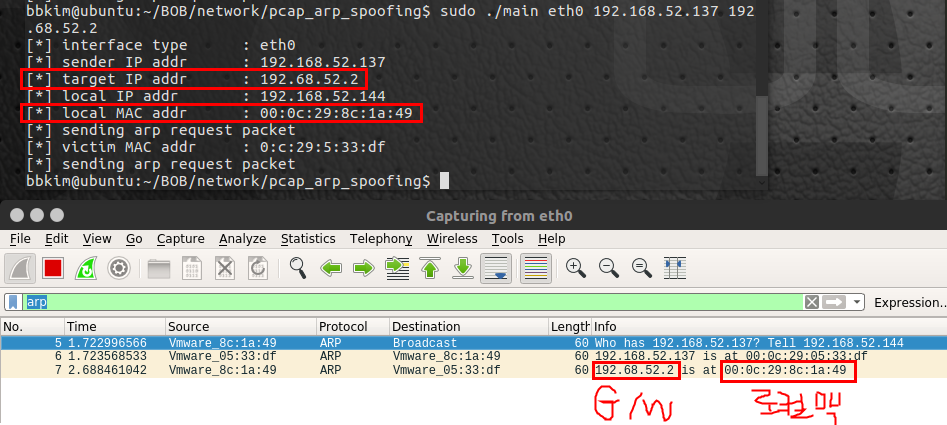
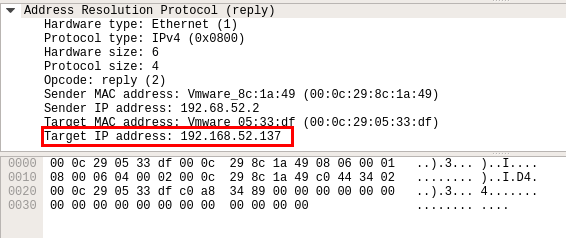
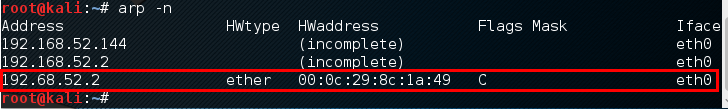

# pcap_arp_spoofing

## What is it??
Simple & Basic arp spoofing tools for Linux

## How To Use?
	1. make
	2. sudo ./output [interface] [victim ip] [target ip]

## Example
###1. execute

###2. check ip with wireshark

###3. check victim's arp table

